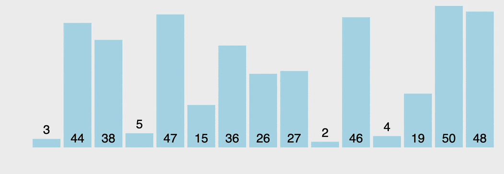

# Le Tri à bulles

Le tri à bulles, est un algorithme de tri simple qui parcourt la liste à trier à plusieurs reprises, compare chaque paire d'éléments adjacents et les échange s'ils sont dans le mauvais ordre (ordre croissant ou décroissant). Le passage dans la liste est répété jusqu'à ce qu'aucun échange ne soit nécessaire, ce qui indique que la liste est triée.

## Complexité

| Meilleur        | Moyen           | Pire  |
| :-------------: |:-------------:| :-------------:|
| O(n)      | O(n2) | O(n2) |

* [Tri à bulle avec une boucle Do While et une For](bubble-sort-do-while.js)
* [Tri à bulle avec deux boucles For imbriquées](bubble-sort-for.js)

Credits image : https://visualgo.net/
