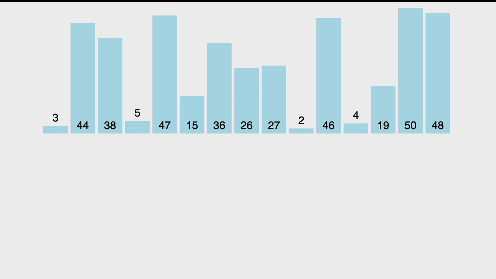

# Le tri par insertion

Le tri par insertion est un algorithme de tri simple qui va "sortir" un élément et le comparer avec chaque élément à sa gauche et les échanger s'ils sont dans le mauvais ordre (ordre croissant ou décroissant). Chaque élément est traiter une seule fois et considéré comme trié après qu’il soit repositionné.
Cet algorithme est considéré comme lent sur de grandes séquences mais rapide sur des petites entrées ou déjà presque triées (meilleurs cas).

## Complexité

| Meilleur        | Moyen           | Pire  |
| :-------------: |:-------------:| :-------------:|
| O(n)      | O(n²) | O(n²) |

* [Tri par insertion avec une boucle For](insertion-sort-for.js)

Credits image : https://visualgo.net/

